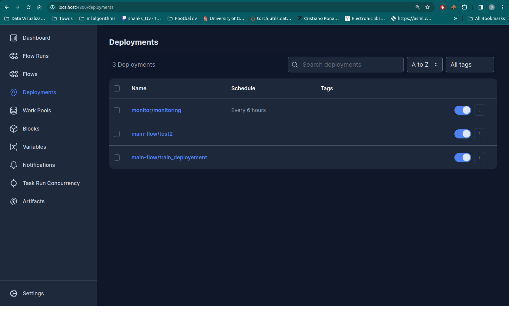
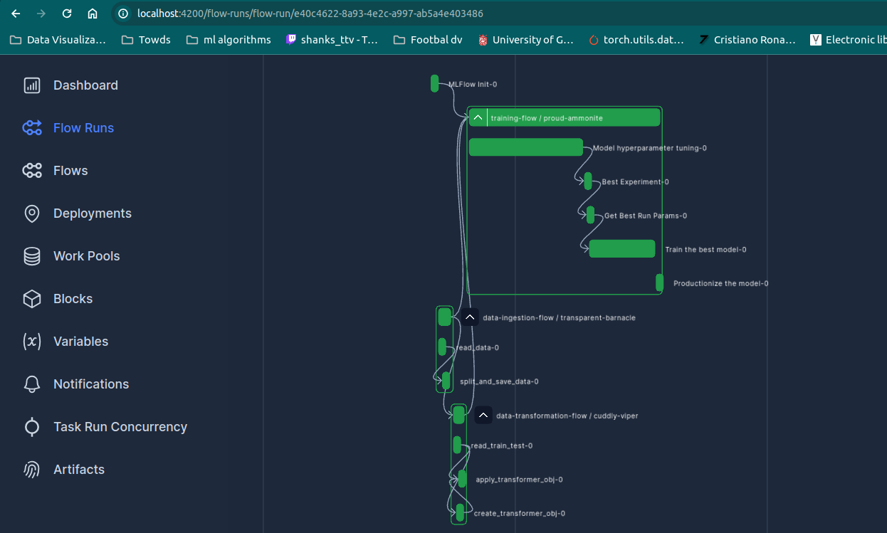

## MLOps Capstone Project: Pricemyride


### Project Description

This project is a comprehensive application for predicting used car prices, combining advanced modeling, workflow management, and robust monitoring. It's designed to efficiently deploy and maintain machine learning models, ensuring accurate and reliable price predictions.

### Problem Statement and Objective

The used car market is often unpredictable, making it hard to accurately assess a car's value. Our goal is to create a tool that predicts used car prices efficiently, simplifying the buying and selling process with reliable, data-driven valuations.


### Design & flow architecture


### Language, frameworks, libraries, Services and Tools used to bootstrap this project.

* 
* 
* 
*  
*  
* 
*  
* <a href='https://mlflow.org/images/MLflow-logo-final-white-TM.png' target="_blank"></a> 
* <a href='https://cdn.worldvectorlogo.com/logos/prefect-1.svg' target="_blank"></a>
* <a href='https://cdn.worldvectorlogo.com/logos/prefect-1.svg' target="_blank"></a>  
* <a href='' target="_blank"></a> 
* <a href='' target="_blank"></a>  
* 
* 
* 
* 


### Project overview
PRICEMYRIDE integrates a variety of services and tools  a cloud-based setup with automated training, monitoring, and inference processes.
The ML model to predict vehicle prices, is trained locally with gradient boosting frameworks like XGBoost. The trained model is containerized using Docker.

For deployment, the ML model is sent to an Amazon EC2 instance where it's monitored by Evidently AI, a tool used for monitoring ML models in production. The monitoring script monitor.py is scheduled by Prefect, a workflow management system, ensures that the model is performing as expected and triggers retraining if drift is detected.

The inference process is handled by a Flask backend, which is also containerized using Docker for consistent deployment. Gunicorn serves as the WSGI server, interfacing between Flask and the web. This backend interacts with a PostgreSQL database, storing monitoring metrics and the model's predictions. The monitoring metrics are visualized using Grafana, which provides a real-time monitoring dashboard for the analytics.

The frontend is powered by Streamlit, which is known for its ability to create interactive web apps quickly, making it accessible to stakeholders to input data and receive ride pricing predictions. The MLflow tool is used for experiment tracking and model management, while artifacts are stored in an S3 bucket, demonstarting a systematic approach to tracking and storing different versions of the ML model.


### Gathering and Preprocessing Vehicle Data
Instead of developing a custom API or scraping data from websites like Craigslist, I leveraged the pre-existing, comprehensive dataset from [AustinReese/UsedVehicleSearch](https://github.com/AustinReese/UsedVehicleSearch). This dataset encompasses a robust and extensive collection of 400,000 observations, offering a valuable foundation for our analysis. The data was carefully partitioned into training and testing subsets, with the testing subset also functioning as a reference point for data drift monitoring. This methodology ensures that our model is both well-trained and continuously aligned with current market trends, enhancing its accuracy and applicability in real-world scenarios.

EDA was conducted to refine the dataset, discarding irrelevant information and retaining only essential data for model development. Outliers were identified and removed, and gaps in data were filled for completeness. A preprocessor was then constructed to handle categorical data, applying techniques like one-hot and ordinal encoding

### Steps to recreate the project

#### AWS Pre-Setup
Initially, I set up an AWS EC2 instance, opting for a t3.medium instance for its flexibility to experiment and handle various tasks. If your project requirements are modest, a t3.micro, which is part of AWS's free tier, could suffice.

Next, I created an S3 bucket for storing our code and MLflow artifacts.

Before configuring the AWS CLI, it's essential to obtain the Access Key ID and Secret Access Key from the AWS Identity and Access Management (IAM). These credentials are crucial for secure access.

Finally, to facilitate access to the S3 bucket from our code, I configured the AWS CLI. This is done using the following command:
```bash
aws configure
```

#### Server Initialization

Within the EC2 instance, I opted to utilize Prefect for workflow orchestration and MLflow for model tracking and management.

Install the above mentioned libraries using the following command

```bash
pip install prefect==2.14.10 mlflow==2.9.2
```

To simplify the process of starting up the servers for this project, we utilize a Makefile. This Makefile contains predefined commands which automate the setup and launching of our servers. To start the servers, simply run the following command in the terminal:

```bash
make train 
```
The MLFlow User Interface is accessible at [http://localhost:5000](http://localhost:5000), thanks to Visual Studio Code's auto-setup for port forwarding. If it's not functioning as expected, ensure port 5000 is open in your EC2 instance's security rules. The UI can then be accessed via [http://<ec2_public_address>:5000](http://<ec2_public_address>:5000). Similarly, for Prefect, make sure the required port (default is 4200) is also forwarded or opened to access its dashboard, following similar steps.


#### Setting up Prefect


Once the servers have started, we next need to setup prefect because its the backbone of the project.

In prefect we basically have two deployements, one for training and one for monitoring. To set up the deployements we need to create prefect blocks which act like the building blocks.

The following project has 6 blocks.


Setting up these blocks involves standard procedures. With basic configuration details, you can easily establish them on your EC2 instance.

Ensure you specify the custom image name in the Docker block settings. This image, which I have uploaded to Docker Hub, includes all the necessary libraries pre-installed for training.


This project requires you to have Docker and Docker Compose pre-installed on your system.

Once u have done this go to the root directory and build the train deployement using the following command

```bash
prefect deployment build train/pipelines/train_pipe.py:main_flow \
  -n train_deployement \
  -q test \
  -sb s3-bucket/mys3bucket\
  -ib docker-container/testdocker \
  -o train \
  --apply
```

The command triggers Prefect to launch a deployment, where it pulls a custom Docker image from Docker Hub. This image is configured with all required libraries. During execution, the code stored in the S3 bucket is accessed and run within this custom Docker environment.

To gain a better understanding of the command and to delve deeper into the process, please refer to the following [article](https://towardsdatascience.com/create-robust-data-pipelines-with-prefect-docker-and-github-12b231ca6ed2).


Now that the training deployment is completed, let's proceed with setting up the monitoring deployment. Monitoring is a relatively lightweight and simpler task compared to training and because of that we'll use a different storage block for the deployment process.

```bash
prefect deployment StreamPredictorKit/monitor.py:monitor \
  -n monitor \
  -q test \
  -sb github/gitmyride \
  -o monitor \
  --apply
```

This command makes sure that whenever the monitor deployement is triggered, The code is pulled from the github repository and is executed.




After executing the commands, you will notice that two deployments will be visible in the Prefect UI. Before initiating this deployment, it's essential to launch an agent. The agent will continually poll for deployments.

Since the training process is computationally intensive, I prefer to run it on my local instance. To do this, I start the agent on my local machine using the following command:

```bash
prefect agent start -q 'test'
```

Now u can run the deployement from prefect ui, schedule it or trigger it from other deployements.




### Deploying the application

To deploy the application, simply use the command 

```bash
make deploy
```

Once this command is executed, there are multiple services that are started. You can find the frontend to interact with the app at [http://<ec2_public_address>:8501](http://<ec2_public_address>:8501)


You can also access adminer to check out the data entered by the users or the drift metrics calculated from evidently at [http://localhost:8080](http://localhost:8080)


Check the status of the Docker containers to ensure all services are running using

```bash
docker ps
```
If any docker service fails to start or you encounter any errors, check the Docker container logs for error messages:

```bash
docker logs <container_name>
```

### Monitoring
Effective monitoring is crucial for maintaining the health of the PriceMyRide application. So we constanly run a prefect deployement 4 times a day to check if there is any data drift or model drift encountered.

#### Monitoring Services
- **Evidently AI**: Monitors the performance and data drift of the ML model.
- **Grafana**: Provides dashboards for real-time analytics and system metrics.

#### Accessing Monitoring Tools
- **Grafana Dashboard**: Access the Grafana interface at `http://<ec2_public_address>:3000`. Default login details can be found in the deployment configuration file.

#### Performance Metrics Approach

For PriceMyRide, we focused on tracking data drift metrics first. This was a strategic choice, ensuring our model stays up-to-date with market changes. 
As my knowledge continues to evolve, I plan to incorporate additional performance metrics over time.


### Code Best Practices

The following have been developed:

- [ ] Unit test
- [ ] Integration test
- [x] Auto code formatter using Black
- [x] Makefile